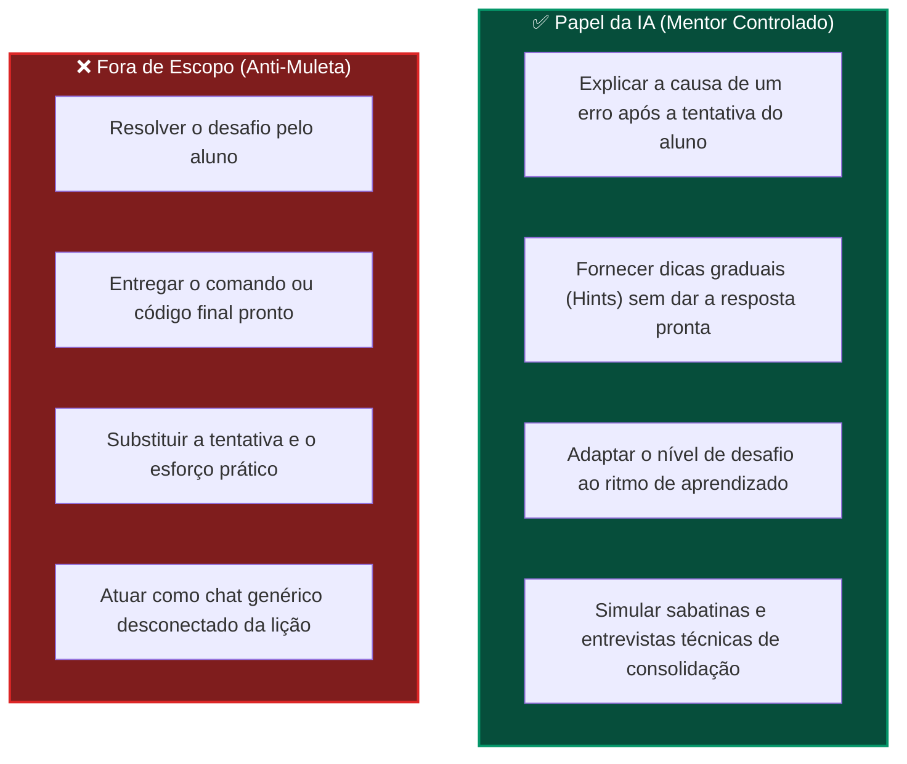
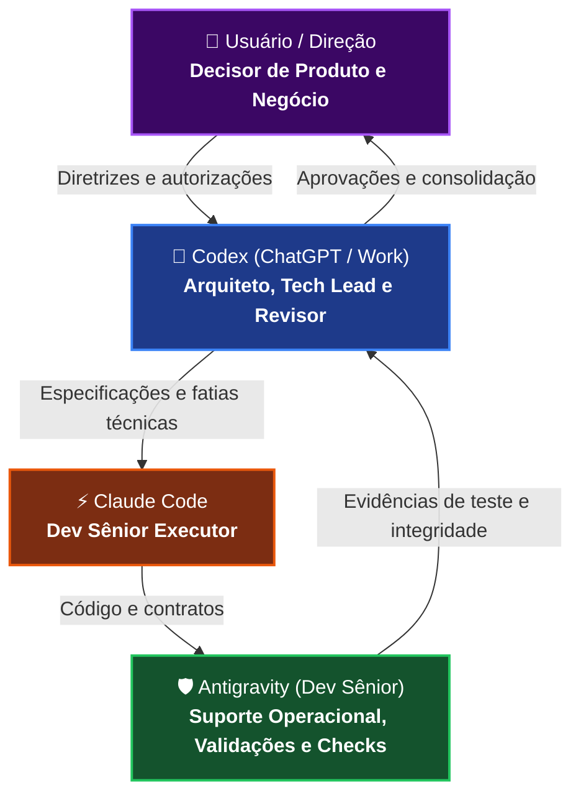
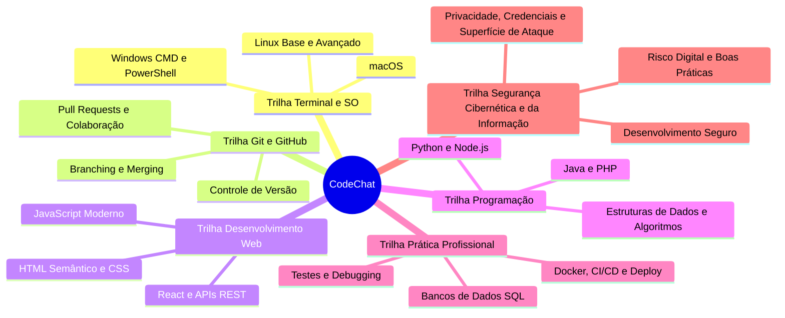
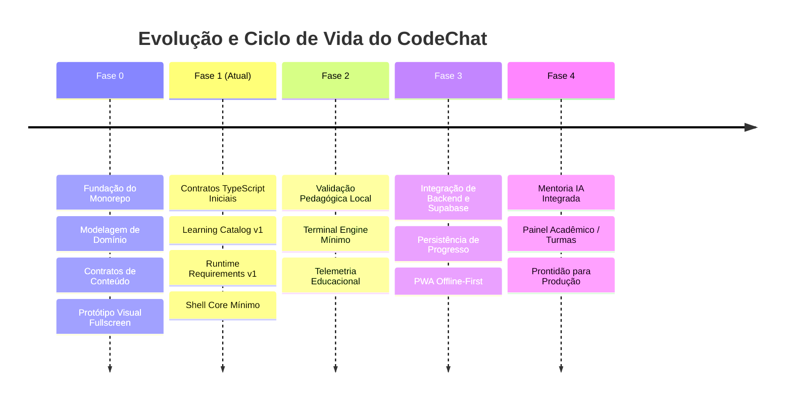
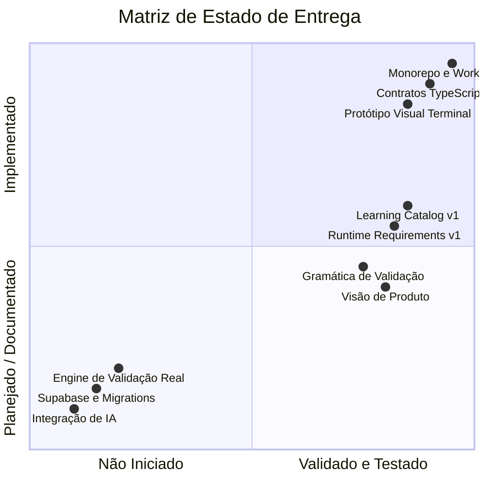

# CodeChat — Cérebro Operacional Visual

> **Documento Executivo e Visual de Governança e Estado do Projeto**
>
> Destinado à consulta executiva, alinhamento institucional e validação com a Direção da universidade e liderança técnica.
>
> **Dashboard navegável**: abra `docs/operations/visual-dashboard/index.html` no navegador para uma apresentação guiada em HTML/CSS/JS no estilo Graphfy.

---

## 1. Resumo Executivo

O **CodeChat** é uma plataforma educacional progressiva (PWA) projetada para capacitar estudantes e profissionais em transição de carreira, guiando o aluno do **zero absoluto à prontidão real para o mercado de desenvolvimento de software**.

Ao contrário de plataformas puramente teóricas ou baseadas em quizzes passivos, o CodeChat adota uma metodologia prática onde o aprendizado ocorre diretamente no **terminal simulado**, enfrentando desafios reais, mensagens de erro autênticas e construindo autonomia técnica com rigor de engenharia.

---

## 2. Visão de Produto e Pilares Estratégicos

### 2.1. O Diferencial: Modo Raiz

O **Modo Raiz** é a espinha dorsal metodológica do CodeChat. A interface foca na experiência autêntica de desenvolvimento:

- **Prática Real**: O aluno interage com um ambiente de terminal fiel, executando comandos e manipulando arquivos.
- **Erros Autênticos**: Falhas de sintaxe, permissão e caminhos não são mascaradas; o aluno aprende a ler a saída e a corrigir o problema.
- **Foco Total na Tela**: Interface limpa e imersiva (terminal fullscreen), eliminando distrações visuais e elementos dispensáveis.

### 2.2. IA como Mentor Pedagógico Controlado (Não Muleta)

A Inteligência Artificial atua estritamente como um facilitador pedagógico sob regras de governança rigorosas:

---

## 3. Mapa Visual de Governança dos Agentes

O projeto opera sob um modelo de governança com papéis bem delimitados, garantindo rastreabilidade, qualidade e zero regressão:

| Papel                 | Responsabilidade Principal   | Escopo de Ação                                                                                               |
| :-------------------- | :--------------------------- | :----------------------------------------------------------------------------------------------------------- |
| **Direção / Usuário** | Direção de Produto e Negócio | Aprovação de fases, definição de valor e autorização de publicação.                                          |
| **Codex**             | Arquiteto e Tech Lead        | Desenho arquitetural, revisão de código e governança técnica.                                                |
| **Claude Code**       | Dev Sênior Executor          | Implementação técnica em fatias curtas, testáveis e desacopladas.                                            |
| **Antigravity**       | Suporte Operacional e QA     | Validação local contínua (`typecheck`, `lint`, `test`, `format`), inspeção de locks e relatórios executivos. |

---

## 4. Mapa das Trilhas Estratégicas de Formação

O currículo educacional é estruturado em trilhas modulares que cobrem todo o espectro da formação técnica:

---

## 5. Mapa Visual das Fases do Projeto

---

## 6. Status Técnico Atual e Fatias Concluídas

A tabela abaixo resume os marcos técnicos oficialmente homologados no repositório:

| Marco Técnico                           | Commit / Referência                 | Status     | Impacto no Projeto                                                                                               |
| :-------------------------------------- | :---------------------------------- | :--------- | :--------------------------------------------------------------------------------------------------------------- |
| **Fundação do Monorepo**                | `bc52763`                           | Publicado  | Estrutura modular (`apps/` e `packages/`) com pnpm workspaces e TypeScript rigoroso.                             |
| **Modelagem de Domínio e Contratos v1** | `e3ab4af`                           | Publicado  | Definição formal das entidades pedagógicas e fronteiras técnicas.                                                |
| **Planejamento de Banco e RLS**         | `c09bf74`                           | Publicado  | Estrutura relacional planejada e regras de segurança sem acoplamento prematuro.                                  |
| **Currículo Fase 0 e Validações**       | `3ca2096`                           | Publicado  | Gramática de validação declarativa e lições inaugurais de terminal.                                              |
| **Protótipo Visual Fullscreen**         | `bd82a83`                           | Publicado  | Interface imersiva de terminal aprovada pela direção de produto.                                                 |
| **Contratos TypeScript Fase 1**         | `a4c53f7`                           | Publicado  | Tipos de execução desacoplados (`ExecutionResult`, `ValidationRule`, `VirtualFileSystemSnapshot`).               |
| **Visão de Produto Registrada**         | `docs/product/product-vision-v1.md` | Registrado | Posicionamento comercial, política de IA pedagógica e mapa de trilhas.                                           |
| **Trilha 06 em Radar**                  | `docs/product/product-vision-v1.md` | Registrado | Segurança cibernética e da informação como pilar estratégico de formação, ainda sem currículo executável.        |
| **Learning Catalog v1**                 | `0d29750`                           | Publicado  | Catálogo formalizado com 6 trilhas, 20 segmentos e contratos `Track -> Course -> Module -> Lesson -> Challenge`. |
| **Runtime Requirements v1**             | `bebc3ea`                           | Publicado  | Restrições conceituais por adapter (`virtual-shell`, `pyodide`, `webcontainer`, `remote-runner`).                |

---

## 7. O Que Já Está Validado vs. O Que Ainda Não Está Implementado

Para garantir transparência executiva com a Direção, o escopo é categorizado com clareza:

### ✅ O Que Já Está Validado

1. Arquitetura de Monorepo configurada com build, linting e testes automatizados.
2. Contratos técnicos TypeScript isolados e validados por suíte de testes unitários (`vitest`).
3. Protótipo visual de terminal em tela cheia validado em ambiente local (`http://127.0.0.1:5174/`).
4. Gramática declarativa de regras de validação documentada e consistente.
5. Diretrizes de governança e documentação viva (`Cérebro Operacional.md`).
6. Learning Catalog v1 publicado com 6 trilhas e 20 segmentos.
7. Runtime Requirements v1 publicado com perfis conceituais de runtime por adapter.

### ⏳ O Que Ainda Não Está Implementado (Próximas Etapas)

1. **Shell Core / Terminal Engine Mínimo**: Primeiros comandos da Fase 0 com filesystem virtual em memória.
2. **Parser e Execução de Comandos**: Implementação incremental das engines de terminal e adaptadores.
3. **Funções Reais de Validação**: Mecanismo que compara o resultado do comando com a regra da lição.
4. **Política Ética da Trilha 06**: Regras de isolamento e limites antes de qualquer exercício executável de segurança.
5. **Persistência Remota / Supabase**: Criação de tabelas reais, autenticação e sincronização de progresso.
6. **Integração Real de IA**: Mecanismo de mentoria pedagógica e geração de dicas progressivas.

---

## 8. Riscos e Controles Operacionais

| Risco Potencial                                 | Nível | Mecanismo de Controle Aplicado                                                                                          |
| :---------------------------------------------- | :---: | :---------------------------------------------------------------------------------------------------------------------- |
| **Acoplamento Prematuro de Backend**            | Médio | Não criar migrations ou tabelas Supabase antes do motor pedagógico local estar validado.                                |
| **Complexidade Excessiva no Terminal**          | Médio | Implementar comandos em fatias mínimas e testáveis, evitando simular 21 utilitários de uma só vez.                      |
| **Vazamento de Regras Pedagógicas na Execução** | Alto  | `ExecutionResult` é 100% agnóstico e desconhece o conceito de `Challenge` ou `Progress`.                                |
| **Dependência Excessiva de IA pelo Aluno**      | Alto  | Regra rígida de produto: IA não resolve exercícios, não fornece respostas prontas e só atua sob demanda após tentativa. |
| **Regressões no Código-Base**                   | Baixo | Pipeline de checagem obrigatório antes de qualquer avanço (`typecheck`, `lint`, `test`, `format:check`).                |

---

## 9. Como Apresentar para a Direção da Universidade

Ao conduzir a apresentação executiva deste projeto para a reitoria, coordenação ou investidores, recomenda-se a seguinte linha de abordagem:

1. **Abertura (O Problema)**: "Estudantes de tecnologia frequentemente aprendem programação em ambientes artificiais e chegam ao mercado sem saber operar um terminal, depurar erros reais ou usar ferramentas profissionais."
2. **A Solução (CodeChat)**: "Uma plataforma imersiva 'Modo Raiz' que ensina desenvolvimento prático diretamente no terminal, unindo rigor técnico a um suporte inteligente."
3. **O Papel da IA (Diferencial Competitivo)**: "Nossa IA não é um gerador de código que substitui o aluno; ela atua como um professor particular experiente, oferecendo orientação progressiva e ensinando o estudante a pensar de forma crítica."
4. **Maturidade Técnica (Governança)**: "O projeto segue padrões de engenharia de software de ponta: monorepo modular, contratos tipados, cobertura de testes automatizados e evolução incremental orientada a riscos."
5. **Demonstração Prática**: Apresentar o protótipo visual em tela cheia do terminal (`apps/web`), demonstrando a imersão e o foco do aluno.

---

## 10. Próxima Fatia Recomendada

A próxima entrega técnica planejada e recomendada pelo time de engenharia é a **Fase 1 — Shell Core / Terminal Engine Mínimo**:

- Implementar uma fatia mínima do terminal virtual com poucos comandos da Fase 0.
- Preservar `ExecutionResult` agnóstico, filesystem virtual em memória e validadores determinísticos.
- Evitar implementação em massa dos 21 comandos; avançar por lotes pequenos, testáveis e revisados.
