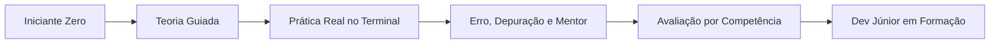
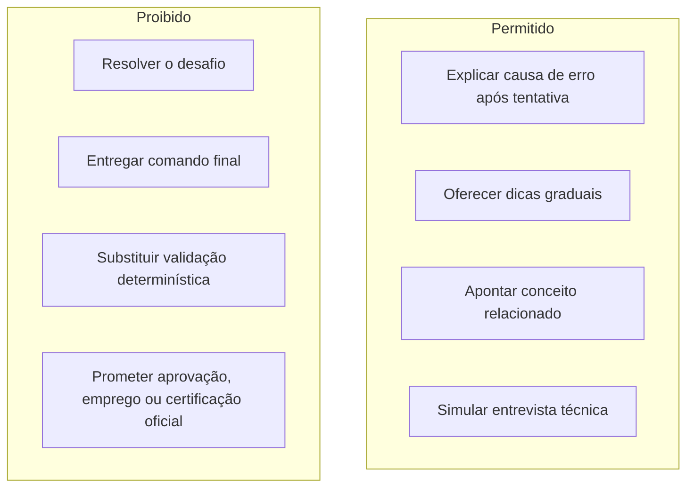
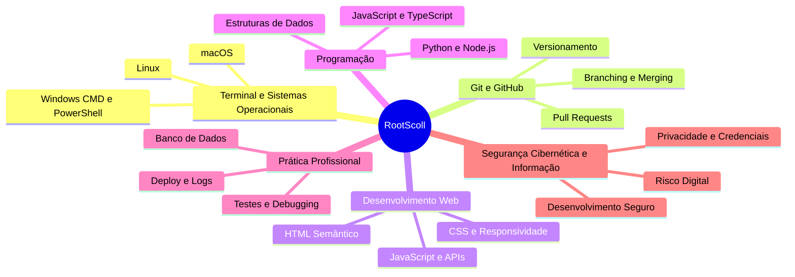
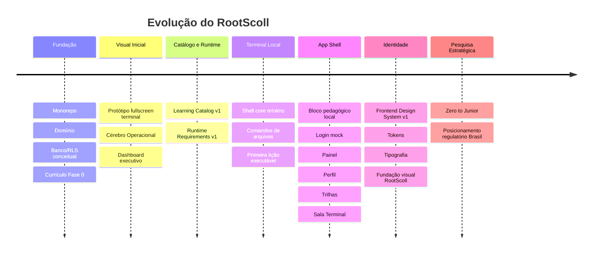

# RootScoll — Cérebro Operacional Visual

> **Documento executivo e visual de governança e estado do projeto**
> Destinado à consulta executiva, alinhamento institucional e validação com direção de produto,
> liderança técnica e parceiros educacionais.

---

## 1. Resumo Executivo

O **RootScoll** é uma plataforma educacional progressiva projetada para capacitar estudantes e
profissionais em transição de carreira, guiando o aluno do zero absoluto à prontidão real para o
mercado de desenvolvimento de software.

Ao contrário de plataformas puramente teóricas ou baseadas em quizzes passivos, o RootScoll adota
uma metodologia prática onde o aprendizado ocorre em uma sala de aula técnica, com terminal,
desafios, erros reais, avaliação por competência e orientação pedagógica progressiva.

---

## 2. Pilares Estratégicos

### 2.1. Modo Raiz

O **Modo Raiz** é a espinha dorsal metodológica do RootScoll:

- **Prática real**: o aluno executa comandos, manipula arquivos e constrói projetos.
- **Erros autênticos**: falhas não são mascaradas; o aluno aprende a ler saída, logs e mensagens.
- **Teoria antes da prática**: cada bloco tem aprendizado teórico, aplicação prática e avaliação.
- **Avaliação objetiva**: acerto deve ser validado por regras, testes, execução ou evidência técnica.
- **Mentor controlado**: a IA futura orienta progressivamente, mas não resolve pelo aluno.

### 2.2. IA como Mentor Pedagógico Controlado

---

## 3. Governança dos Agentes

| Papel                  | Responsabilidade Principal   | Escopo de Ação                                                                                    |
| :--------------------- | :--------------------------- | :------------------------------------------------------------------------------------------------ |
| **Direção / Usuário**  | Direção de Produto e Negócio | Aprovação de fases, definição de valor, autorização de commit/push e decisões comerciais.         |
| **Codex**              | Arquiteto e Tech Lead        | Desenho arquitetural, revisão, validação de escopo, governança técnica e consolidação documental. |
| **Claude Code**        | Dev Sênior Executor          | Implementação técnica em fatias curtas, testáveis e desacopladas.                                 |
| **Antigravity**        | Suporte Operacional e QA     | Pesquisa, documentação, validações locais, inspeção de locks e relatórios executivos.             |
| **Gemini Deep Search** | Pesquisa externa             | Pesquisa profunda de mercado, regulação, produto e legislação para posterior curadoria do Codex.  |

---

## 4. Trilhas Estratégicas

Observação: o catálogo v1 publicado mantém 6 trilhas macro; a pesquisa curricular Zero to Junior
propõe 14 trilhas granulares como visão pedagógica futura.

---

## 5. Linha do Tempo

---

## 6. Marcos Técnicos

| Marco Técnico                         | Commit / Referência                                | Status     | Impacto no Projeto                                                            |
| :------------------------------------ | :------------------------------------------------- | :--------- | :---------------------------------------------------------------------------- |
| Fundação do Monorepo                  | `bc52763`                                          | Publicado  | Estrutura modular com pnpm workspaces e TypeScript.                           |
| Domain Model v1 e Engine Contracts v1 | `e3ab4af`                                          | Publicado  | Entidades pedagógicas e contratos de execução.                                |
| Planejamento de Database e RLS        | `c09bf74`                                          | Publicado  | Modelo conceitual sem acoplamento prematuro.                                  |
| Currículo Fase 0                      | `3ca2096`                                          | Publicado  | Primeiras lições e gramática de validação.                                    |
| Protótipo Visual Fullscreen           | `bd82a83`                                          | Publicado  | Direção visual inicial aprovada.                                              |
| Contratos TypeScript Fase 1           | `a4c53f7`                                          | Publicado  | `ExecutionResult`, `ValidationRule`, filesystem virtual.                      |
| Dashboard Executivo                   | `fedb314`                                          | Publicado  | Cérebro visual e dashboard navegável.                                         |
| Product Vision v1                     | `docs/product/product-vision-v1.md`                | Publicado  | Norte de produto, IA pedagógica e trilhas estratégicas.                       |
| Learning Catalog v1                   | `0d29750`                                          | Publicado  | 6 trilhas macro, segmentos e contratos `Track -> Course -> Module -> Lesson`. |
| Runtime Requirements v1               | `bebc3ea`                                          | Publicado  | Perfis conceituais por adapter/runtime.                                       |
| Shell Core Mínimo                     | `49663d8`                                          | Publicado  | `pwd`, `ls`, `cd`, `mkdir` em filesystem virtual.                             |
| Comandos de Arquivos do Terminal      | `d6d0252`                                          | Publicado  | `touch`, `cat`, `echo`, `cp`, `mv`, `rm`, `tree`.                             |
| Primeira Lição Executável Local       | `c61fa72`                                          | Publicado  | `apps/web` conectado ao `terminal-engine`.                                    |
| App Shell RootScoll + Frontend System | `53699be`                                          | Publicado  | App shell, fluxo pedagógico local, imagens e `docs/frontend.md`.              |
| Currículo Zero to Junior              | `docs/product/zero-to-junior-curriculum-v1.md`     | Em revisão | 14 trilhas granulares; precisa de aprofundamento de fontes e granularidade.   |
| Fundação Visual RootScoll             | `apps/web/src/styles/{tokens,typography}.css`      | Em revisão | Tokens, tipografia, foco e retokenização visual; pendente commit.             |
| Posicionamento Regulatório Brasil     | `docs/product/regulatory-positioning-brazil-v1.md` | Em revisão | Tese comercial/regulatória segura para Brasil; exige parecer jurídico futuro. |

---

## 7. Validado vs. Pendente

### Validado / Publicado

1. Monorepo e workspaces.
2. Contratos TypeScript iniciais.
3. Documentação de domínio, banco conceitual, runtime e catálogo.
4. Terminal engine mínimo e comandos de arquivo.
5. Primeira lição executável local.
6. App shell local com login mock, painel, perfil, trilhas e sala Terminal.
7. `docs/frontend.md` como fonte visual oficial RootScoll.

### Em Revisão Local

1. Fundação visual RootScoll no `apps/web`.
2. Currículo Zero to Junior.
3. Posicionamento regulatório Brasil.

### Ainda Não Implementado

1. Avaliador formal `(ExecutionResult, ValidationRule) -> ValidationOutcome`.
2. Roteador real com URLs.
3. Persistência remota e autenticação real.
4. Supabase, migrations e RLS real.
5. IA real.
6. Dashboard professor/admin.
7. Certificados/atestados em produção.

---

## 8. Riscos e Controles

| Risco                              | Nível | Controle                                                                               |
| :--------------------------------- | :---: | :------------------------------------------------------------------------------------- |
| Promessa educacional indevida      | Alto  | Usar posicionamento de plataforma/ecossistema; evitar diploma, técnico, MEC e emprego. |
| Certificado com linguagem insegura | Alto  | Preferir atestado/participação até parecer jurídico.                                   |
| IA virar muleta                    | Alto  | IA orienta, mas validação de acerto permanece determinística.                          |
| Supabase prematuro                 | Médio | Manter local-first até aprovação de schema/RLS.                                        |
| Execução de código do aluno        | Alto  | Sandbox, isolamento e logs antes de runtime remoto real.                               |
| Conflito entre agentes             | Médio | Separar frentes: Claude em código visual, Antigravity/Gemini em pesquisa/documentação. |

---

## 9. Posicionamento Comercial Seguro

Recomendado:

- Plataforma digital de apoio à aprendizagem técnica.
- Ecossistema de aprendizado prático em tecnologia.
- Laboratório interativo de programação e terminal.
- Trilhas livres de capacitação técnica.
- Evidências de competência e portfólio prático.

Evitar:

- Reconhecido pelo MEC.
- Diploma.
- Curso técnico oficial.
- Certificação profissional oficial.
- Garantia de emprego.
- Substitui faculdade.
- Aproveitamento acadêmico garantido.

---

## 10. Próxima Fatia Recomendada

1. **Fechar a fundação visual RootScoll**: revisar diffs do Claude, rodar validações reais, commit e
   push se aprovado.
2. **Aprofundar currículo Zero to Junior**: usar Gemini/Antigravity para enriquecer fontes,
   granularidade aula-a-aula e critérios de avaliação.
3. **Consolidar posicionamento regulatório**: submeter `regulatory-positioning-brazil-v1.md` a
   advogado antes de copy pública, certificado/atestado ou venda B2B.
4. **Próxima fatia de código**: validadores locais formais ou lapidação UI/UX dos painéis densos,
   sem Supabase, auth real ou IA real.
