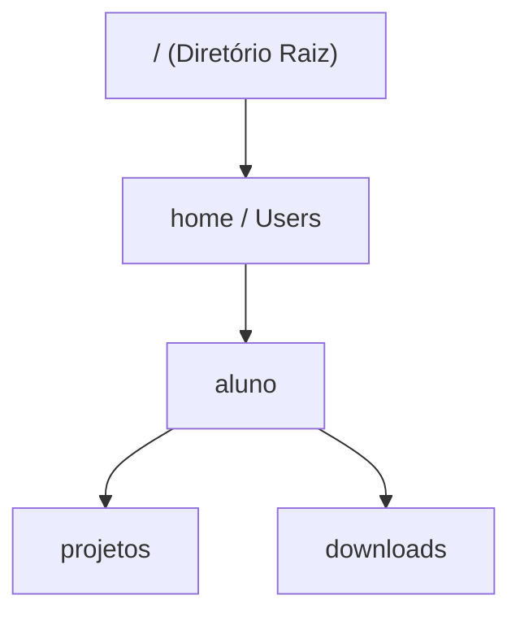

# Bloco 01: Navegação no Terminal (`pwd`, `ls`, `cd`)

---

## 1. Contexto

Imagine tentar encontrar um arquivo em uma biblioteca de 1 milhão de livros sem ter um mapa ou saber em qual prateleira você está pisando. Na interface gráfica (GUI), você depende de clicar em ícones e pastas com o mouse. No desenvolvimento de software real, servidores e nuvens não possuem tela nem mouse — operam puramente via linha de comando. Dominar o terminal é o seu primeiro passo para obter o controle total da sua máquina.

---

## 2. Teoria Curta

O terminal é um interpretador de texto (Shell) que executa ordens para o Sistema Operacional. Para navegar sem se perder, você precisa dominar 3 conceitos de localização:



| Comando | Nome Completo | O que faz | Analogia do Mundo Físico |
| :--- | :--- | :--- | :--- |
| `pwd` | Print Working Directory | Mostra onde você está agora | Seu GPS / "Você está aqui" |
| `ls` | List | Lista o conteúdo da pasta atual | Olhar ao redor na sala |
| `cd` | Change Directory | Muda de pasta | Dar um passo para dentro/fora da prateleira |

- **Caminho Absoluto:** Começa da raiz do sistema (ex: `/Users/aluno/projetos` ou `C:\Users\aluno`).
- **Caminho Relativo:** Começa de onde você está agora (ex: `./projetos` ou `..` para subir um nível).

---

## 3. Exemplo Trabalhado

Abaixo está uma sequência real executada no terminal com comentários detalhados:

```bash
# 1. Verificar em qual diretório o sistema se encontra
pwd
# Saída esperada: /Users/aluno (no Linux/macOS) ou C:\Users\aluno (no Windows)

# 2. Listar todos os arquivos e pastas no diretório atual
ls
# Saída esperada: Desktop Downloads Documents

# 3. Entrar na pasta 'Documents' usando caminho relativo
cd Documents

# 4. Confirmar que a navegação funcionou
pwd
# Saída esperada: /Users/aluno/Documents

# 5. Voltar um nível para a pasta anterior usando '..'
cd ..
```

---

## 4. Prática Guiada

**Exercício de Fixação (Preencha as Lacunas):**

1. Para saber exatamente em qual pasta você está no momento, você digita o comando `_____`.
2. Para subir um nível no diretório (voltar para a pasta pai), você deve usar o comando `cd _____`.
3. Para listar o conteúdo da pasta atual incluindo arquivos ocultos, usamos `ls _____` (Dica: opção `-a`).

---

## 5. Prática Independente

**Requisitos de Aceite:**
1. Abra o seu terminal.
2. Navegue até o diretório `rootscoll/sandbox/`.
3. Dentro do diretório `rootscoll/sandbox/`, crie manualmente a seguinte estrutura de pastas:
   - `projeto-alpha`
   - `projeto-beta`
4. Entre no diretório `projeto-alpha` e confirme sua localização com `pwd`.

---

## 6. Erros Esperados

| Erro Comum | Causa Raiz | Como Identificar |
| :--- | :--- | :--- |
| `cd: no such file or directory` | Digitar o nome da pasta com erro de maiúscula/minúscula ou pasta inexistente. | O terminal não encontra o alvo digitado. |
| Espaços em nomes de pasta | Digitar `cd meu projeto` sem aspas. O terminal entende como dois argumentos separados. | Use aspas: `cd "meu projeto"` ou use hífen (`meu-projeto`). |
| Ficar "preso" sem saber voltar | Não entender a diferença entre `.` (pasta atual) e `..` (pasta anterior). | Lembre-se: `cd ..` sempre sobe 1 nível. |

---

## 7. Mentor (Dicas Progressivas)

Se você estiver com dificuldades na Prática Independente, consulte as dicas por nível:

- **💡 Nível 1 (Pista):** Certifique-se de que está na raiz da workspace antes de navegar para `rootscoll/sandbox`.
- **💡 Nível 2 (Orientação):** O comando para criar pastas é `mkdir` (veja se a pasta `sandbox` existe).
- **💡 Nível 3 (Solução orientada):** Digite `cd rootscoll/sandbox`, depois `mkdir projeto-alpha projeto-beta` e por fim `cd projeto-alpha`.

---

## 8. Avaliação Objetiva

Para validar se você concluiu a Prática Independente com sucesso, execute o validador no terminal:

```bash
node rootscoll/scripts/run-validator.js rootscoll/tracks/01-terminal-os/01-navegacao
```

---

## 9. Reflexão

Após concluir a avaliação objetiva, preencha o arquivo de reflexão obrigatório:
👉 [reflexao.md](file:///c:/Dev/CodeChat/rootscoll/tracks/01-terminal-os/01-navegacao/reflexao.md)
