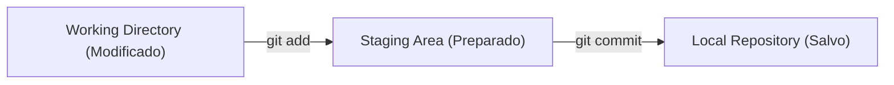

# Bloco 01: Diário de Bordo Técnico & Versionamento Git

---

## 1. Contexto

Como desenvolvedor, você escreverá códigos que mudarão constantemente. Sem um sistema de controle de versão, você acabará criando pastas como `projeto-v1`, `projeto-final`, `projeto-final-mesmo-final`. O Git é o padrão da indústria para rastrear cada alteração do seu código no tempo, permitindo "viajar no tempo", colaborar com outros devs e recuperar código perdido.

---

## 2. Teoria Curta

O Git funciona gravando "retratos" (snapshots) do seu projeto chamados **Commits**. O ciclo de vida dos arquivos possui 3 estados principais:



| Comando | O que faz | Analogia do Mundo Físico |
| :--- | :--- | :--- |
| `git init` | Inicializa um repositório Git na pasta atual | Criar um novo álbum de fotos em branco |
| `git status` | Mostra quais arquivos foram modificados ou preparados | Olhar quais itens estão na mesa de trabalho |
| `git add <arquivo>` | Move alterações para a Staging Area | Colocar as fotos no envelope antes de selar |
| `git commit -m "mensagem"` | Grava as alterações permanentemente no histórico | Selar o envelope com uma etiqueta descritiva |

---

## 3. Exemplo Trabalhado

```bash
# 1. Inicializar o repositório na pasta do projeto
git init

# 2. Criar o arquivo do diário
echo "# Meu Diário de Bordo Técnico" > diario.md

# 3. Checar o estado dos arquivos (diario.md aparecerá em vermelho/untracked)
git status

# 4. Adicionar o arquivo à área de preparação (staging area)
git add diario.md

# 5. Fazer o commit semântico explicando o que foi feito
git commit -m "docs: adiciona estrutura inicial do diario de bordo"
```

---

## 4. Prática Guiada

**Exercício de Fixação:**
1. Para verificar quais arquivos foram alterados mas ainda não salvos no commit, você digita `git _____`.
2. O parâmetro obrigatório do `git commit` que descreve o trabalho realizado é `_____`.
3. Um exemplo de mensagem de commit semântico para adicionar uma funcionalidade nova é `feat: _____`.

---

## 5. Prática Independente

**Requisitos de Aceite:**
1. Acesse o diretório `rootscoll/sandbox/`.
2. Crie uma pasta chamada `diario-de-bordo`.
3. Inicialize um repositório Git local dentro de `diario-de-bordo`.
4. Crie o arquivo `diario.md` com o título `# Diário de Bordo RootScoll`.
5. Faça o commit inicial desse arquivo com a mensagem `"docs: cria diario de bordo"`.

---

## 6. Erros Esperados

| Erro Comum | Causa Raiz | Solução |
| :--- | :--- | :--- |
| `fatal: not a git repository` | Executar comandos como `git status` em uma pasta sem `git init`. | Execute `git init` primeiro. |
| Mensagem de commit vaga (ex: "ajustes") | Não seguir o padrão semântico (`feat:`, `docs:`, `fix:`). | Seja específico sobre o que mudou no código. |
| Esquecer de dar `git add` antes do commit | O Git não salva alterações que não foram adicionadas à staging area. | Sempre execute `git add` antes de `git commit`. |

---

## 7. Mentor (Dicas Progressivas)

- **💡 Nível 1:** Lembre-se de entrar na pasta `diario-de-bordo` antes de dar `git init`.
- **💡 Nível 2:** Use `echo "# Diário de Bordo RootScoll" > diario.md` para criar o arquivo rapidamente.
- **💡 Nível 3:** Execute os comandos nesta ordem: `cd rootscoll/sandbox/diario-de-bordo` -> `git init` -> `git add diario.md` -> `git commit -m "docs: cria diario de bordo"`.

---

## 8. Avaliação Objetiva

Para validar se você concluiu a tarefa, execute o validador no terminal:

```bash
node rootscoll/scripts/run-validator.cjs rootscoll/tracks/02-git-github/01-diario-de-bordo
```

---

## 9. Reflexão

Após ser aprovado na validação, preencha sua reflexão técnica:
👉 [reflexao.md](file:///c:/Dev/CodeChat/rootscoll/tracks/02-git-github/01-diario-de-bordo/reflexao.md)
