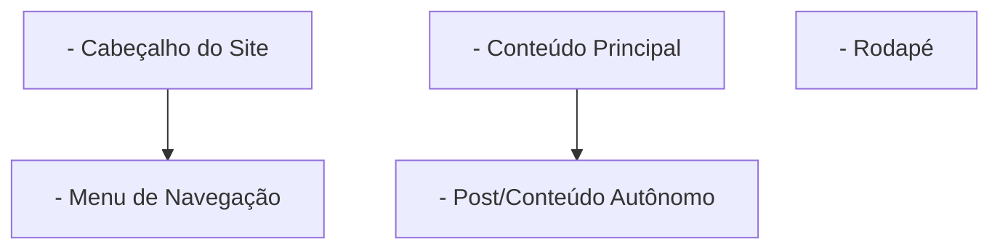

# Bloco 01: Landing Page Acessível & HTML/CSS Semântico

---

## 1. Contexto

Todo aplicativo moderno na Web se baseia em uma estrutura visual e semântica. O HTML define o esqueleto (conteúdo e significado) e o CSS define a forma (visual, layout e responsividade). Escrever HTML semântico garante que leitores de tela para pessoas com deficiência visual consigam navegar pelo seu site, além de melhorar o SEO no Google.

---

## 2. Teoria Curta

### Tags Semânticas HTML5
Evite usar `<div>` para tudo. Use elementos estruturais semânticos:



### O CSS Box Model
Tudo no CSS é uma caixa retangular composta por:
1. **Content**: Conteúdo de texto/imagem.
2. **Padding**: Espaçamento interno entre a borda e o conteúdo.
3. **Border**: A borda ao redor do padding.
4. **Margin**: Espaçamento externo entre esta caixa e os vizinhos.

---

## 3. Exemplo Trabalhado

```html
<!DOCTYPE html>
<html lang="pt-BR">
<head>
  <meta charset="UTF-8">
  <meta name="viewport" content="width=device-width, initial-scale=1.0">
  <title>Landing Page RootScoll</title>
  <link rel="stylesheet" href="style.css">
</head>
<body>
  <header>
    <h1>RootScoll Modo Raiz</h1>
    <nav>
      <a href="#cursos">Cursos</a>
    </nav>
  </header>
  <main>
    <section id="cursos">
      <h2>Aprenda Programação de Verdade</h2>
      <p>Sem atalhos, com prática e erro autêntico.</p>
    </section>
  </main>
  <footer>
    <p>&copy; 2026 RootScoll</p>
  </footer>
</body>
</html>
```

---

## 4. Prática Guiada

**Exercício de Fixação:**
1. A tag HTML adequada para o conteúdo principal da página (que só deve existir 1 vez por página) é `<_____>`.
2. Para fornecer uma descrição textual alternativa para leitores de tela em uma tag ``, usamos o atributo `_____`.
3. Para garantir que um botão seja acessível via teclado, usamos a tag `<_____>` e nunca uma `<div>`.

---

## 5. Prática Independente

**Requisitos de Aceite:**
1. Em `rootscoll/sandbox/landing-page/`, crie os arquivos `index.html` e `style.css`.
2. O arquivo `index.html` deve conter as tags semânticas `<header>`, `<main>` e `<footer>`.
3. O cabeçalho deve conter um título `<h1>` com o nome da sua aplicação.
4. O `style.css` deve remover as margens padrão da página (`margin: 0`) e aplicar uma cor de fundo.

---

## 6. Erros Esperados

| Erro Comum | Causa Raiz | Solução |
| :--- | :--- | :--- |
| Usar `<div>` no lugar de `<button>` | Perda de acessibilidade nativa via teclado (`Tab`/`Enter`). | Use `<button>` para ações interativas. |
| Esquecer a tag `<meta name="viewport">` | O site quebra totalmente em dispositivos móveis. | Sempre inclua a meta tag viewport no `<head>`. |
| Imagens sem texto alternativo (`alt`) | Impedimento de navegação por deficientes visuais. | Adicione `alt="Descrição da imagem"`. |

---

## 7. Mentor (Dicas Progressivas)

- **💡 Nível 1:** Crie a pasta `rootscoll/sandbox/landing-page` e coloque o HTML e CSS nela.
- **💡 Nível 2:** Vincule o CSS ao HTML no `<head>` usando `<link rel="stylesheet" href="style.css">`.
- **💡 Nível 3:** Garanta que as tags `<header>`, `<main>`, `<footer>` e `<h1>` estejam no seu `index.html`.

---

## 8. Avaliação Objetiva

Para validar seu HTML/CSS, execute o validador:

```bash
node rootscoll/scripts/run-validator.cjs rootscoll/tracks/03-web/01-landing-page-acessivel
```

---

## 9. Reflexão

Preencha o diário de reflexão:
👉 [reflexao.md](file:///c:/Dev/CodeChat/rootscoll/tracks/03-web/01-landing-page-acessivel/reflexao.md)
