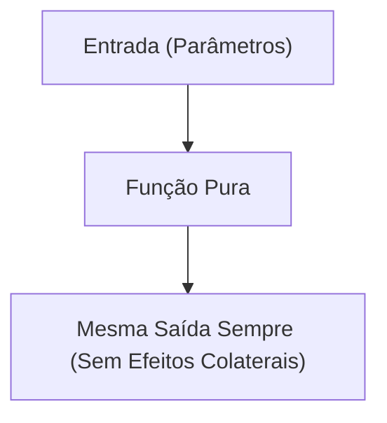

# Submódulo 4a: Vanilla JS I — Lógica Pura e Funções Puras

---

## 1. Contexto

A lógica de programação é a habilidade de decompor um problema complexo em pequenas instruções ordenadas. Em JavaScript puro, você aprenderá a manipular tipos de dados primitivos, estruturas condicionais e funções sem colaterais (funções puras). Entender imutabilidade e funções puras previne que uma parte da aplicação altere acidentalmente dados de outra parte.

---

## 2. Teoria Curta

### Funções Puras vs Impuras



- **Função Pura:** Dado o mesmo parâmetro de entrada, sempre retorna o mesmo resultado e NÃO altera variáveis globais ou estados externos.
- **Imutabilidade:** Em vez de alterar um array original (ex: `push`), criamos uma nova versão do array contendo a alteração (ex: `[...array, novoItem]`).

---

## 3. Exemplo Trabalhado

```javascript
// Exemplo de Função Pura de Adição de Tarefa
function adicionarTarefa(tarefas, novaTarefa) {
  // Retorna um NOVO array usando o operador spread (...), preservando o original
  return [...tarefas, { id: Date.now(), titulo: novaTarefa, concluida: false }];
}

const listaInicial = [{ id: 1, titulo: 'Estudar JS', concluida: true }];
const listaAtualizada = adicionarTarefa(listaInicial, 'Praticar Funções Puras');

console.log('Inicial:', listaInicial.length); // 1 (não mudou)
console.log('Atualizada:', listaAtualizada.length); // 2
```

---

## 4. Prática Guiada

**Exercício de Fixação:**
1. Uma função é considerada pura quando não produz efeitos ________ (colaterais).
2. Para filtrar apenas os elementos que cumprem uma condição em um array sem modificar o array original, usamos o método `.________()`.
3. O operador `===` (estrito) compara valor e ________.

---

## 5. Prática Independente

**Requisitos de Aceite:**
1. Em `rootscoll/sandbox/js-logica/funcoes.js`, exporte uma função chamada `filtrarConcluidas(tarefas)`.
2. A função deve receber um array de objetos `{ id, titulo, concluida }` e retornar um **novo array** contendo apenas as tarefas onde `concluida === true`.
3. A função deve ser pura e não utilizar `push` no array original.

---

## 6. Erros Esperados

| Erro Comum | Causa Raiz | Solução |
| :--- | :--- | :--- |
| Usar `==` em vez de `===` | Coerção implícita de tipo que gera falsos positivos. | Sempre prefira a comparação estrita `===`. |
| Modificar o array original com `splice` ou `push` | Violação da imutabilidade. | Use `filter()`, `map()` ou operador spread `[...]`. |
| Poluição de escopo global | Declarar variáveis sem `const` ou `let`. | Use sempre `const` (padrão) e `let` quando houver reatribuição. |

---

## 7. Mentor (Dicas Progressivas)

- **💡 Nível 1:** Use `tarefas.filter(tarefa => tarefa.concluida === true)`.
- **💡 Nível 2:** Crie o arquivo em `rootscoll/sandbox/js-logica/funcoes.js` e use `module.exports = { filtrarConcluidas };`.
- **💡 Nível 3:** Lembre-se de tratar arrays vazios sem lançar erros.

---

## 8. Avaliação Objetiva

Execute o validador:

```bash
node rootscoll/scripts/run-validator.cjs rootscoll/tracks/04-programming/4a-vanilla-js-1/01-logica-pura
```

---

## 9. Reflexão

👉 [reflexao.md](file:///c:/Dev/CodeChat/rootscoll/tracks/04-programming/4a-vanilla-js-1/01-logica-pura/reflexao.md)
