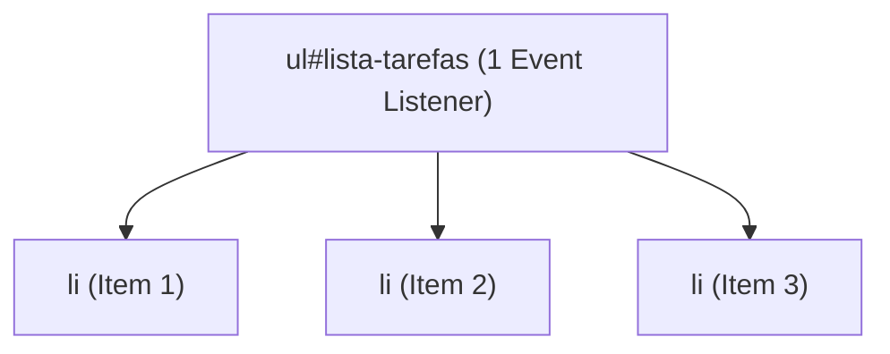

# Submódulo 4b: Vanilla JS II — DOM, Eventos e Projeto Terminal Tasker

---

## 1. Contexto

A manipulação da Document Object Model (DOM) é a ponte entre a lógica JavaScript e a interface exibida ao usuário. Neste módulo, você construirá o projeto **Terminal Tasker**: uma aplicação de gerenciamento de tarefas baseada em interface visual inspirada em linha de comando, salvando os dados no `localStorage` do navegador.

---

## 2. Teoria Curta

### Delegação de Eventos
Em vez de adicionar um escutador de eventos (`addEventListener`) em cada botão de uma lista com centenas de itens, adicionamos **um único escutador no elemento pai** e identificamos qual filho foi clicado através de `event.target`.



### Segurança contra XSS
Nunca use `innerHTML = dadosDoUsuario` sem sanitização! Isso permite que atacantes injetem scripts maliciosos (`<script>`). Prefira sempre `textContent` ou `createElement` + `appendChild`.

---

## 3. Exemplo Trabalhado

```javascript
// Manipulação Segura do DOM
function renderizarTarefa(titulo) {
  const li = document.createElement('li');
  // Usar textContent impede ataques XSS
  li.textContent = titulo;
  
  const botaoDeletar = document.createElement('button');
  botaoDeletar.textContent = 'Remover';
  botaoDeletar.dataset.acao = 'deletar';
  
  li.appendChild(botaoDeletar);
  return li;
}
```

---

## 4. Prática Guiada

**Exercício de Fixação:**
1. A propriedade do elemento DOM recomendada para inserir textos do usuário de forma segura contra XSS é `________`.
2. Para escutar o clique em um formulário e evitar que a página recarregue, usamos `event.________()`.
3. O armazenamento local do navegador que persiste dados mesmo após fechar a aba é o `________`.

---

## 5. Prática Independente (Projeto Terminal Tasker)

**Requisitos de Aceite:**
1. Crie a pasta `rootscoll/sandbox/terminal-tasker/` contendo `index.html` e `app.js`.
2. O arquivo `app.js` deve implementar a função `salvarTarefas(tarefas)` que persiste a lista no `localStorage` sob a chave `'tasker_items'`.
3. A interface deve permitir adicionar uma nova tarefa via formulário e renderizá-la dinamicamente.

---

## 6. Erros Esperados

| Erro Comum | Causa Raiz | Solução |
| :--- | :--- | :--- |
| Recarregamento automático ao enviar formulário | Não chamar `event.preventDefault()`. | Adicione `event.preventDefault()` na primeira linha do handler. |
| Injeção XSS | Usar `innerHTML` para concatenar valores digitados. | Use `textContent` ou `createElement`. |
| Perder dados ao dar F5 | Não persistir no `localStorage`. | Use `localStorage.setItem('chave', JSON.stringify(dados))`. |

---

## 7. Mentor (Dicas Progressivas)

- **💡 Nível 1:** Para converter objetos/arrays em string para o `localStorage`, use `JSON.stringify(dados)`.
- **💡 Nível 2:** Crie a função `salvarTarefas` exportando-a para o ambiente Node caso seja testada pelo validador.
- **💡 Nível 3:** Certifique-se de que a chave usada no `localStorage` seja rigorosamente `'tasker_items'`.

---

## 8. Avaliação Objetiva

Execute o validador:

```bash
node rootscoll/scripts/run-validator.cjs rootscoll/tracks/04-programming/4b-vanilla-js-2/01-terminal-tasker
```

---

## 9. Reflexão

👉 [reflexao.md](file:///c:/Dev/CodeChat/rootscoll/tracks/04-programming/4b-vanilla-js-2/01-terminal-tasker/reflexao.md)
