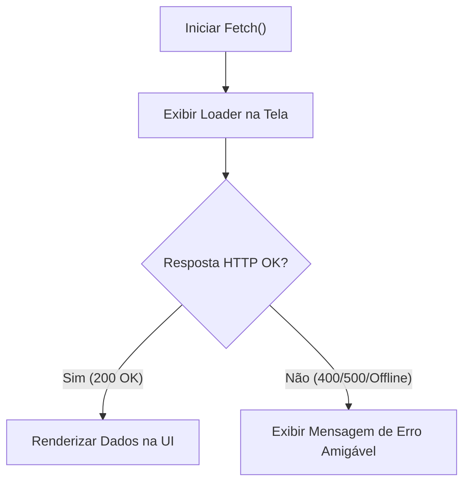

# Submódulo 4c: Assincronismo, HTTP e Dashboard Integrado

---

## 1. Contexto

Na web real, sistemas precisam buscar dados em servidores externos através de APIs HTTP. Requisições de rede levam tempo e podem falhar (queda de conexão, servidor fora do ar, erro 500). Neste módulo, você aprenderá a lidar com Promises, `async/await`, Fetch API e a gerenciar os 3 estados fundamentais de UI: **Carregando (Loading)**, **Sucesso (Data)** e **Erro (Error)**.

---

## 2. Teoria Curta

### O Ciclo de Vida de uma Requisição Assíncrona



- **Promise:** Objeto representando a eventual conclusão ou falha de uma operação assíncrona.
- **`async/await`:** Açúcar sintático que torna o código assíncrono legível e sequencial como código síncrono.
- **`try/catch`:** Bloco para capturar rejeições de rede ou erros de parse.

---

## 3. Exemplo Trabalhado

```javascript
async function buscarDadosDashboard(url) {
  const statusElement = document.getElementById('status');
  statusElement.textContent = 'Carregando dados...';

  try {
    const resposta = await fetch(url);
    if (!resposta.ok) {
      throw new Error(`Erro na API HTTP: Status ${resposta.status}`);
    }
    const dados = await resposta.json();
    statusElement.textContent = 'Dados carregados com sucesso!';
    return dados;
  } catch (erro) {
    console.error('Falha na requisição:', erro);
    statusElement.textContent = 'Não foi possível carregar os dados. Tente novamente.';
    return null;
  }
}
```

---

## 4. Prática Guiada

**Exercício de Fixação:**
1. A palavra-chave que permite aguardar a resolução de uma Promise dentro de uma função marcada com `async` é `________`.
2. Para tratar falhas de rede ou excepções no bloco assíncrono, envolvemos o código em um bloco `try / ________`.
3. O status HTTP `200` significa sucesso, enquanto códigos na faixa `500` indicam erro no ________.

---

## 5. Prática Independente (Projeto Dashboard Integrado)

**Requisitos de Aceite:**
1. Crie o arquivo `rootscoll/sandbox/dashboard/api.js`.
2. Exporte a função assíncrona `buscarMetricashub(endpoint)`.
3. A função deve usar `fetch()`, validar se `resposta.ok` é true, tratar exceções com `try/catch` e retornar os dados em JSON ou um objeto `{ erro: true, mensagem: '...' }` em caso de falha.

---

## 6. Erros Esperados

| Erro Comum | Causa Raiz | Solução |
| :--- | :--- | :--- |
| Tentar usar `dados.length` antes de dar `await resposta.json()` | Esqueceu de aguardar o parse da Promise do JSON. | Sempre coloque `await` na chamada do `.json()`. |
| Não verificar `resposta.ok` | O `fetch()` do navegador NÃO rejeita erros HTTP como 404 ou 500; ele só rejeita falhas de rede físicas. | Cheque manualmente `if (!resposta.ok) throw new Error(...)`. |

---

## 7. Mentor (Dicas Progressivas)

- **💡 Nível 1:** Lembre-se de colocar `async` antes do nome da função.
- **💡 Nível 2:** Use `const res = await fetch(endpoint); if (!res.ok) return { erro: true };`.
- **💡 Nível 3:** Crie `rootscoll/sandbox/dashboard/api.js` exportando `module.exports = { buscarMetricashub };`.

---

## 8. Avaliação Objetiva

Execute o validador:

```bash
node rootscoll/scripts/run-validator.cjs rootscoll/tracks/04-programming/4c-assincronismo-apis/01-dashboard-integrado
```

---

## 9. Reflexão

👉 [reflexao.md](file:///c:/Dev/CodeChat/rootscoll/tracks/04-programming/4c-assincronismo-apis/01-dashboard-integrado/reflexao.md)
