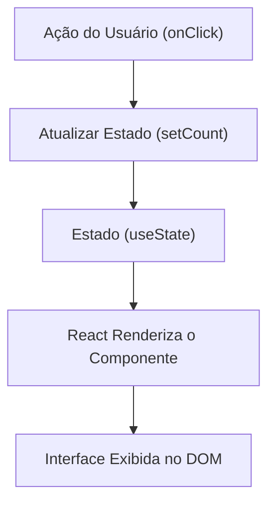

# Submódulo 4d: React — UI Declarativa, Componentes e Estado

---

## 1. Contexto

À medida que as aplicações web crescem, sincronizar o estado da memória manualmente com a árvore do DOM via Vanilla JS se torna extremamente complexo. O React resolve isso com o modelo de **Interface Declarativa**: você descreve como a interface DEVE SER para um determinado Estado, e o React atualiza o DOM automaticamente através do Virtual DOM.

---

## 2. Teoria Curta

### O Fluxo de Dados Unidirecional e Estado (`useState`)



- **Componente:** Função JavaScript que retorna JSX (sintaxe HTML dentro do JS).
- **Props:** Argumentos passados de um componente pai para um componente filho (somente leitura).
- **Estado (`useState`):** Dado mutável interno de um componente que, quando alterado, dispara a re-renderização da UI.

---

## 3. Exemplo Trabalhado

```jsx
import React, { useState } from 'react';

function ContadorDeMetrica({ tituloInicial }) {
  // Declaração de variável de estado
  const [contador, setContador] = useState(0);

  return (
    <div className="card-metrica">
      <h3>{tituloInicial}</h3>
      <p>Total de Registros: {contador}</p>
      {/* NUNCA altere 'contador' diretamente; use 'setContador' */}
      <button onClick={() => setContador(prev => prev + 1)}>
        Incrementar
      </button>
    </div>
  );
}

export default ContadorDeMetrica;
```

---

## 4. Prática Guiada

**Exercício de Fixação:**
1. A sintaxe que permite escrever elementos no formato HTML dentro de funções JavaScript no React é chamada `________`.
2. Para re-renderizar um componente quando uma informação muda, utilizamos o Hook `________`.
3. As propriedades passadas de pai para filho são chamadas `________` e são imutáveis dentro do filho.

---

## 5. Prática Independente

**Requisitos de Aceite:**
1. Crie o arquivo `rootscoll/sandbox/react-app/CardStatus.jsx`.
2. O componente `CardStatus` deve receber as props `titulo` e `status`.
3. Deve utilizar o Hook `useState` para alternar um estado interno `ativo` (booleano) ao clicar em um botão "Alternar Status".

---

## 6. Erros Esperados

| Erro Comum | Causa Raiz | Solução |
| :--- | :--- | :--- |
| Tentar alterar estado diretamente: `contador = contador + 1` | O React não detecta a mudança e a UI não atualiza. | Sempre use a função atualizadora: `setContador(contador + 1)`. |
| Loop infinito com `useEffect` sem array de dependências | Executar `setState` dentro do `useEffect` sem restringir quando ele roda. | Passe o array de dependências `[]` como segundo parâmetro do `useEffect`. |

---

## 7. Mentor (Dicas Progressivas)

- **💡 Nível 1:** Lembre-se de importar `useState` de `'react'`.
- **💡 Nível 2:** Use `const [ativo, setAtivo] = useState(false);`.
- **💡 Nível 3:** No evento do botão, faça `onClick={() => setAtivo(!ativo)}`.

---

## 8. Avaliação Objetiva

Execute o validador:

```bash
node rootscoll/scripts/run-validator.cjs rootscoll/tracks/04-programming/4d-react/01-ui-declarativa
```

---

## 9. Reflexão

👉 [reflexao.md](file:///c:/Dev/CodeChat/rootscoll/tracks/04-programming/4d-react/01-ui-declarativa/reflexao.md)
