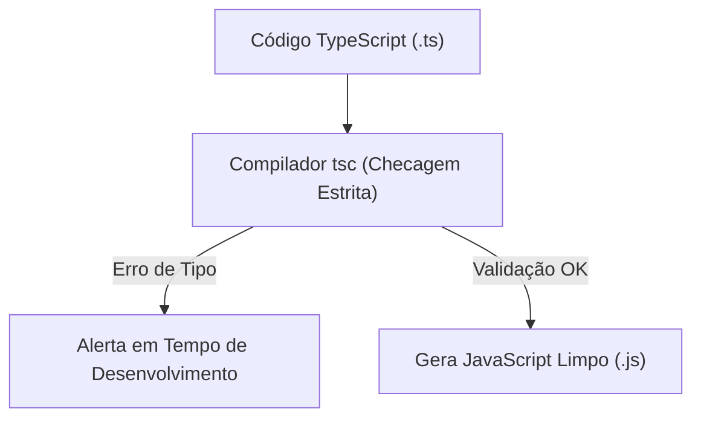

# Submódulo 4e: TypeScript — Tipagem Estrita e Qualidade de Código

---

## 1. Contexto

Após sentir as dores de bugs causados por propriedades inexistentes, chamadas de funções com argumentos trocados e valores `undefined` em tempo de execução, o TypeScript surge como uma ferramenta essencial. Ele adiciona **checagem estática de tipos** ao JavaScript durante a compilação, permitindo que você encontre erros no momento em que digita no editor, antes de publicar seu código.

---

## 2. Teoria Curta

### Inferência vs Anotação Explícita de Tipos



- **Interfaces & Types:** Contratos que definem a "forma" exata que um objeto deve possuir.
- **Modo Estrito (`strict: true`):** Desabilita o uso de `any` implícito e força a verificação rigorosa de nulos (`null`/`undefined`).

---

## 3. Exemplo Trabalhado

```typescript
// Definição de contrato rígido
interface Usuario {
  id: number;
  nome: string;
  email: string;
  perfil?: 'admin' | 'aluno'; // Propriedade opcional
}

function formatarUsuario(usuario: Usuario): string {
  // O autocomplete da IDE ajuda e previne chamadas inválidas
  return `[${usuario.id}] ${usuario.nome} (${usuario.email})`;
}

// Erro capturado em tempo de compilação:
// formatarUsuario({ id: "1", nome: "Ana" }); // TypeScript acusa erro!
```

---

## 4. Prática Guiada

**Exercício de Fixação:**
1. A palavra-chave usada para definir a estrutura de contrato de um objeto em TypeScript é `________`.
2. O tipo genérico "fuga" que desativa a checagem de tipos do TypeScript e que **deve ser evitado** a todo custo é o `________`.
3. O parâmetro de configuração no `tsconfig.json` que ativa o nível máximo de rigor é `"strict": ________`.

---

## 5. Prática Independente

**Requisitos de Aceite:**
1. Crie o arquivo `rootscoll/sandbox/ts-app/types.ts`.
2. Defina a interface `Livro` com os campos: `id` (number), `titulo` (string), `autor` (string), `disponivel` (boolean).
3. Exporte uma função `verificarDisponibilidade(livro: Livro): boolean`.

---

## 6. Erros Esperados

| Erro Comum | Causa Raiz | Solução |
| :--- | :--- | :--- |
| Usar `any` para escapar de erros de compilação | Anular os benefícios da checagem de tipos. | Crie `interfaces` ou `types` apropriados. |
| Erro de `Object is possibly 'null'` | Tentar acessar propriedade sem checar se a variável existe. | Use optional chaining (`objeto?.propriedade`) ou guardas de tipo. |

---

## 7. Mentor (Dicas Progressivas)

- **💡 Nível 1:** Crie a interface `interface Livro { ... }`.
- **💡 Nível 2:** Na função, anote explicitamente `function verificarDisponibilidade(livro: Livro): boolean { return livro.disponivel; }`.
- **💡 Nível 3:** Exporte a interface e a função para permitir que o validador importe.

---

## 8. Avaliação Objetiva

Execute o validador:

```bash
node rootscoll/scripts/run-validator.cjs rootscoll/tracks/04-programming/4e-typescript/01-tipagem-estrita
```

---

## 9. Reflexão

👉 [reflexao.md](file:///c:/Dev/CodeChat/rootscoll/tracks/04-programming/4e-typescript/01-tipagem-estrita/reflexao.md)
