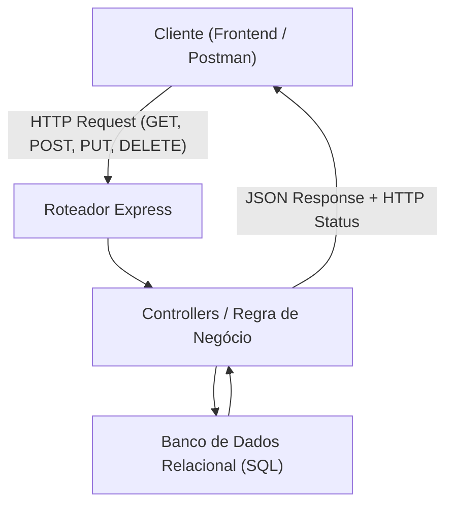

# Bloco 01: API REST de Biblioteca, Node.js, Express & SQL Relacional

---

## 1. Contexto

No mundo profissional, aplicações corporativas exigem persistência confiável em Bancos de Dados Relacionais, além de APIs RESTful estruturadas, autenticação segura e registro rastreável de eventos (logs). Neste módulo, você integrará Node.js, Express, banco de dados SQL relacional e suíte de testes de integração para criar a **API REST de Biblioteca**.

---

## 2. Teoria Curta

### Arquitetura de uma API REST Profissional



- **Mapeamento REST:**
  - `GET /livros`: Listagem de livros.
  - `POST /livros`: Criação de livro.
  - `PUT /livros/:id`: Atualização completa.
  - `DELETE /livros/:id`: Remoção.
- **SQL Relacional:** Tabelas compostas por Chave Primária (`PRIMARY KEY`) e Chave Estrangeira (`FOREIGN KEY`) garantindo integridade referencial.

---

## 3. Exemplo Trabalhado

```javascript
const express = require('express');
const app = express();
app.use(express.json());

// Banco em memória simulando SQL
const livrosDB = [];

// Rota POST com validação básica
app.post('/api/livros', (req, res) => {
  const { titulo, autor } = req.body;
  
  if (!titulo || !autor) {
    return res.status(400).json({ erro: 'Os campos titulo e autor são obrigatórios.' });
  }
  
  const novoLivro = { id: livrosDB.length + 1, titulo, autor };
  livrosDB.push(novoLivro);
  
  return res.status(201).json(novoLivro);
});
```

---

## 4. Prática Guiada

**Exercício de Fixação:**
1. O código de status HTTP que deve ser retornado após a criação bem-sucedida de um recurso via POST é o `________` (201).
2. O middleware do Express necessário para processar o corpo da requisição em formato JSON é `app.use(express.________())`.
3. Em SQL relacional, o comando para recuperar dados filtrados de duas tabelas conectadas é o `SELECT ... JOIN ... ON ________`.

---

## 5. Prática Independente (Projeto API REST de Biblioteca)

**Requisitos de Aceite:**
1. Crie a pasta `rootscoll/sandbox/api-biblioteca/` contendo `server.js`.
2. O `server.js` deve ser uma aplicação Express com a rota `GET /health` retornando `{ status: "ok" }` com HTTP status 200.
3. Deve implementar a rota `POST /api/livros` validando obrigatoriedade dos campos e retornando HTTP 201.

---

## 6. Erros Esperados

| Erro Comum | Causa Raiz | Solução |
| :--- | :--- | :--- |
| `req.body` vem como `undefined` | Esqueceu de colocar `app.use(express.json())`. | Adicione o middleware JSON antes de declarar as rotas. |
| Retornar status HTTP 200 para erros | Não definir o status adequado nas respostas de erro. | Use `res.status(400).json(...)` ou `res.status(500)`. |
| Armazenar senhas em texto puro | Vulnerabilidade gravíssima de segurança. | Use bcrypt para gerar hashes de senha. |

---

## 7. Mentor (Dicas Progressivas)

- **💡 Nível 1:** Crie a pasta `rootscoll/sandbox/api-biblioteca` e crie o `server.js`.
- **💡 Nível 2:** Instale ou simule a exportação do app Express para que o teste consiga validar.
- **💡 Nível 3:** Garanta que a rota `GET /health` responda rigorosamente com JSON `{ status: "ok" }`.

---

## 8. Avaliação Objetiva

Execute o validador:

```bash
node rootscoll/scripts/run-validator.cjs rootscoll/tracks/05-professional-practice/01-api-rest-biblioteca
```

---

## 9. Reflexão

👉 [reflexao.md](file:///c:/Dev/CodeChat/rootscoll/tracks/05-professional-practice/01-api-rest-biblioteca/reflexao.md)
